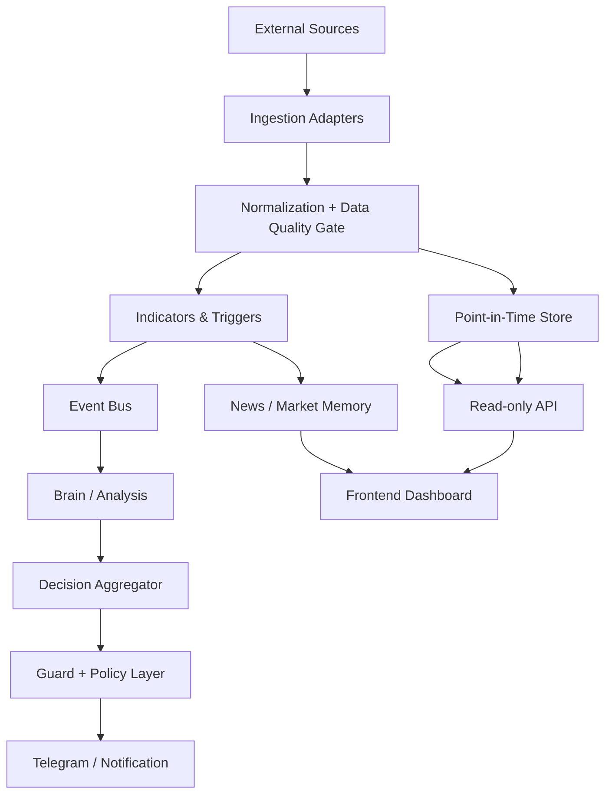
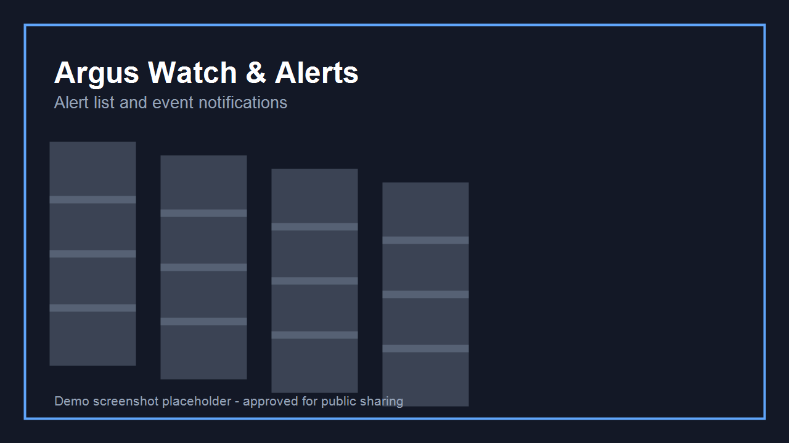
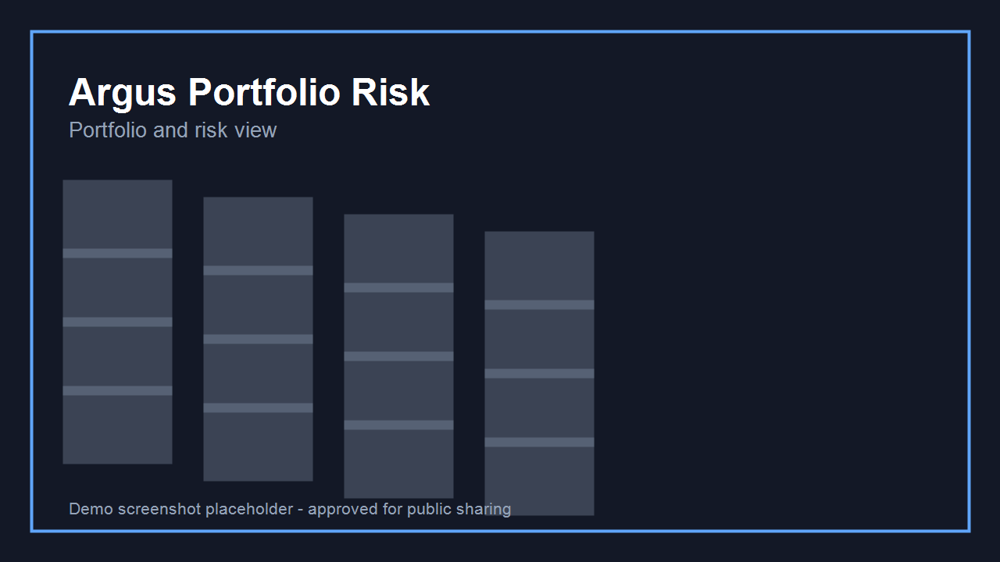
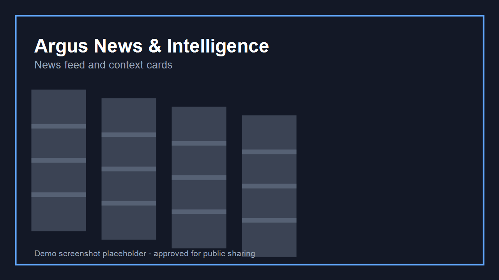

# Argus Product Showcase

**Argus is a private, portfolio-focused market monitoring and decision-support platform for crypto, equities, and macro-aware signals with a strong emphasis on data quality, traceability, and execution safety.**

## Private product showcase

**Private product showcase — proprietary source code is not included in this repository.**

## Product overview

Argus is designed as a continuously running, multi-layer observability and analysis system. It ingests market and event data, applies deterministic data-quality checks, runs an LLM-augmented analysis flow only when justified by trigger thresholds, and presents all outputs through controlled channels with explicit “informational advisory” framing.

## Problem solved

Many automation projects in this space overload users with noisy alerts, implicit assumptions, and fragile data workflows. Argus addresses this by separating data ingestion, analysis, risk controls, and presentation, while explicitly avoiding unaudited, fabricated, or forced actions.

## High-level solution

- Source-typed ingestion with strict normalization.
- Deterministic pre-processing and event filtering.
- Conditional analysis to reduce unnecessary model calls and cost.
- Structured proposal generation for transparency.
- Read-only dashboard and command/reporting surfaces.
- Explicit controls around secrets, sessions, and auditability.

## Verified core capabilities

Capabilities below are based on source-observed implementation evidence.

- Continuous watch loop with session-aware cadence and pull/push flow handling (Implemented).
- Data quality gating for schema validation, freshness, and duplicate/outlier handling (Implemented).
- Time-series persistence for point-in-time market observations (Implemented).
- Multi-factor trigger model with cooldown and deduplication (Implemented).
- Conditional LLM invocation through role-aware routing and budget guard (Implemented).
- Telegram notifications, command entry points, and priority routing (Implemented).
- Dashboard API (read-only) and browser frontend for status, alerts, analyses, portfolio view, and news feed (Implemented).
- Settings/config endpoints for masked secret updates and operational parameters (Implemented).
- Execution/trade placement in live mode (Planned; not included in current public-facing evidence).
- Streaming server-sent updates for all widgets (Partially implemented; some surfaces currently polling-based in current state).

## Technology stack (verified)

- **Python 3.11+** backend orchestration.
- **Pydantic / pydantic-settings** for typed configuration and schemas.
- **FastAPI** dashboard/read API.
- **SQLite** storage for logs, outcomes, news, and analysis journal.
- **Redis** for optional event bus patterns.
- **ccxt** and **borsapy** for market and Turkish market adapters (where configured).
- **Anthropic Claude** and **local Ollama** support through a provider-agnostic LLM seam.
- **React + Vite + TypeScript** frontend.
- **Tailwind CSS**-based styling and **lightweight charts** where chart views exist.
- **Structlog, APScheduler, ruff, mypy, pytest** in the current implementation.

## Engineering challenges and approaches

- **Cost control for LLM usage**: Analysis is event-gated; model calls are not continuous and spend limits are enforced.
- **Data trustworthiness**: The system uses type-level contracts and explicit freshness tagging to distinguish fresh, stale, and unavailable data.
- **Operational resilience**: Retry + circuit breaker patterns and degraded mode behavior prevent full-system failures.
- **No fabricated execution**: Analysis logic is advisory; recommendation wording and workflow are framed as decision support.
- **Secret isolation**: Secret handling is environment-based and masked before presentation.

## My responsibilities

- I scoped the architecture into clear platform layers, kept ingestion and analysis decoupled, and documented the end-to-end flow as a defensible product system.
- I implemented/iterated the reliability-oriented patterns (typed contracts, quality gates, readiness/health signals, and idempotent flows) and made sure they are visible in the product-facing surfaces.
- I designed the public-facing presentation as a source-free portfolio artifact so external audiences can evaluate engineering depth without exposing internal logic.

## Current status

This repository is in showcase mode and intentionally excludes proprietary implementation files. The private Argus codebase is in an active private repository with:

- Completed foundations (layered architecture, data flow, dashboard auth/status surfaces).
- Ongoing/partial work (execution connectors, some real-time streaming refinements, and advanced extension points).

Please see [docs/PROJECT_STATUS.md](./docs/PROJECT_STATUS.md) for the evidence-backed status matrix.

## Screenshot section (safe placeholders)

Until approved images are added, use placeholders below:

## Confidentiality and IP

This repository is a professional portfolio artifact only. It excludes:

- Application source code (all backend/frontend implementation files).
- Proprietary prompts, scoring formulas, and strategy logic.
- Secrets, credentials, and `.env` data.
- Any operational IDs, private URLs, or private machine paths.

See [LICENSE.md](./LICENSE.md) for rights and usage restrictions.

## Available for freelance work

I am open to freelance engagements that involve:

- Product engineering architecture reviews.
- Python service design for data pipelines and event-driven systems.
- Building secure AI-assisted analytics workflows.
- Frontend dashboards for monitoring and alert operations.

I can prepare scoped statements of work and architecture briefs for similar decision-support systems.

**Contact:** please use the project discussion channel when sharing your requirements.  

## Where to start in this repo

- [docs/PRODUCT_OVERVIEW.md](./docs/PRODUCT_OVERVIEW.md)
- [docs/ARCHITECTURE.md](./docs/ARCHITECTURE.md)
- [docs/FEATURES.md](./docs/FEATURES.md)
- [docs/ENGINEERING_HIGHLIGHTS.md](./docs/ENGINEERING_HIGHLIGHTS.md)
- [docs/SECURITY_AND_PRIVACY.md](./docs/SECURITY_AND_PRIVACY.md)
- [docs/PROJECT_STATUS.md](./docs/PROJECT_STATUS.md)
- [docs/SCREENSHOT_GUIDE.md](./docs/SCREENSHOT_GUIDE.md)
