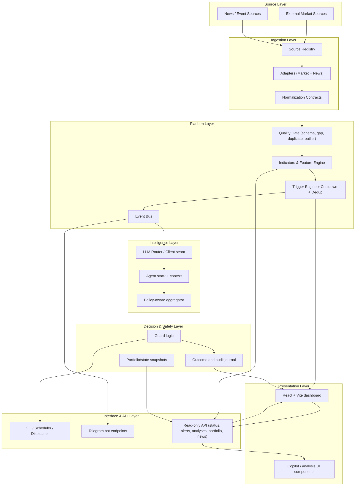

# Architecture

## High-level architecture summary

Argus is organized as a layered, event-driven system with strict interface boundaries between data, analysis, and presentation.

## Cross-cutting concerns

- **Storage**: point-in-time persistence for market series and decision records.
- **Configuration**: runtime settings, thresholds, and watchlist values are separated from core logic.
- **Security**: authentication, authorization gates, secret handling, and prompt sanitization practices.
- **Observability**: health checks, status signals, and operational logs used to support debugging and confidence.
- **Resilience**: retry, circuit-breaker behavior, and degraded-mode responses when source quality is insufficient.

## Data flow (high level)

1. Source adapters fetch and normalize incoming market/news data.
2. The quality gate validates shape, freshness, and integrity.
3. Indicators and triggers compute local conditions and event risk.
4. Events move through the bus to analysis, notification, and persistence layers.
5. Analysis output is aggregated and guarded before being surfaced.
6. Read-only API and dashboard present structured state, alerts, and historical outcomes.

## Notes on safety boundaries

This repository intentionally excludes deep internal policy implementation and exact scoring formulas. The architecture emphasizes:

- clear separation of observed data versus advisory output;
- explicit no-hallucination contract when evidence is missing;
- and a strict “no secret exposure” principle in both API and UI surfaces.
